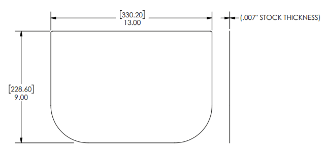
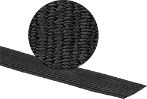
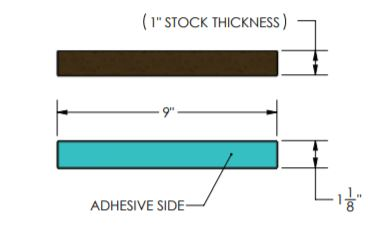

**MATERIALS LIST**

\~ $1,500 TO MAKE 990 FACE SHIELDS WITH MCMASTER-CARR PARTS AND A
STAPLER

**CLEAR SHIELD**

CLEAR POLYESTER FILM - 0.007" THICK

MCMASTER-CARR PART NUMBER 8567K64
([[https://www.mcmaster.com/8567k64]{.underline}](https://www.mcmaster.com/8567k64))

(OTHER THICKNESSES AND MATERIALS SUCH AS PET, PETG, POLYCARBONATE ARE
GOOD SUBSTITUTES. BONUS FOR ANTI-FOG COATING.)

ROLLS ARE 25 FT LONG X 40 IN WIDE AND COST 78 dol. YOU CAN GET 99 PARTS
FROM A ROLL. ORDER 10 ROLLS TO MAKE 999 SHIELDS PER SHIELD COST \~\$0.79

NOTE: Vector line work is included on Page 4 of this drawing for laser
and die cutting.

**ELASTIC HEADBAND**

ELASTIC LATEX FABRIC (1\" WIDE X 13\" LONG)

MCMASTER-CARR PART NUMBER 88225K68
([[https://www.mcmaster.com/88225k68]{.underline}](https://www.mcmaster.com/88225k68))

ROLLS ARE 36 FT LONG AND COST \$11. YOU CAN GET 33 PARTS FROM A ROLL.
ORDER 31 ROLLS TO MAKE 1000 SHIELDS PER SHIELD COST \~\$0.34

Please note that this elastic has latex and some people are allergic to
it. It is highly preferred to use a non-latex elastic but McMaster does
not offer one. Hospitals MAY accept latex IF it is clearly labeled.

**BROW FOAM**

ADHESIVE BACKED POLYURETHANE FOAM (1\" TO 1 3/8" THICK) MCMASTER-CARR
PART NUMBER 8614K84 (https://www.mcmaster.com/8614k84)

SHEETS ARE 60\" X 54\" AND COST \$112. YOU CAN GET 288 PARTS FROM A
SHEET. ORDER 4 SHEETS TO MAKE 1000 SHIELDS PER SHIELD COST \~\$0.40

**A NOTE ON MATERIAL SELECTION**

We chose these materials because they are simple to order and come from
one supplier. As this design catches on, it's likely that McMaster-Carr
will struggle to keep up. We encourage you to find alternative
suppliers. Many different clear plastics will work, even transparency
film! Many foams will work and glue can be substituted for adhesive
backing. We know this can be daunting, but you can do it. Use your inner
MacGyver!
